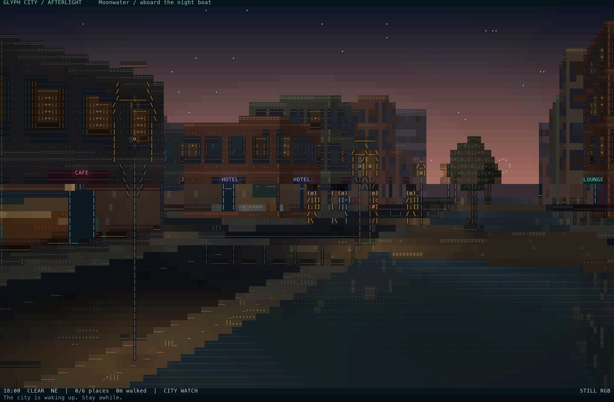
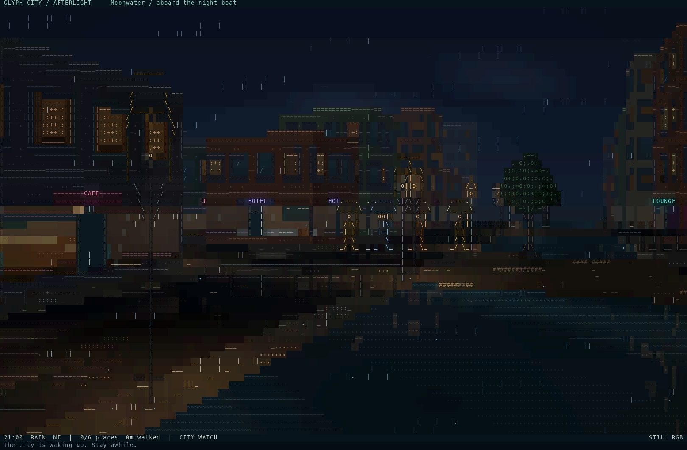
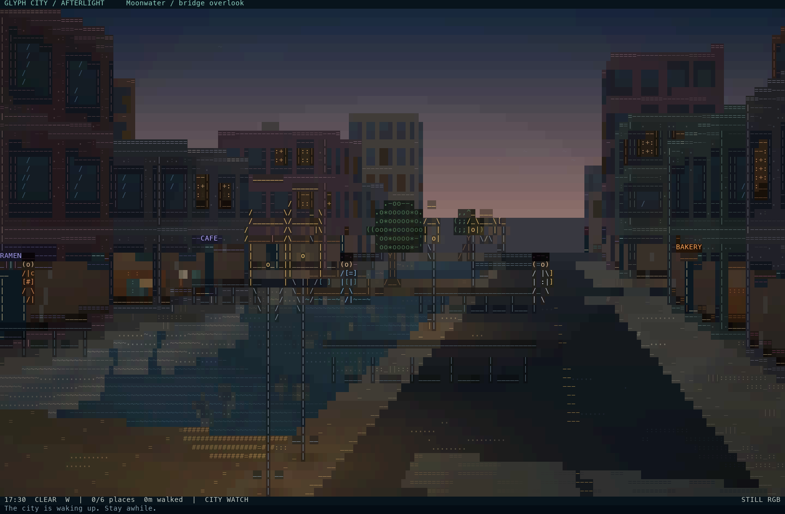
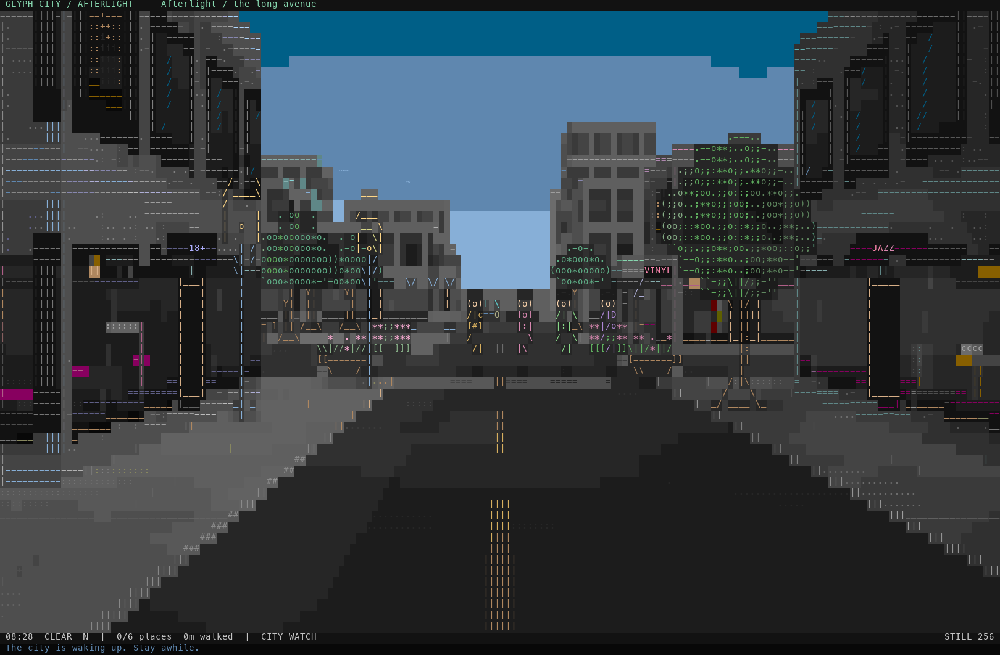
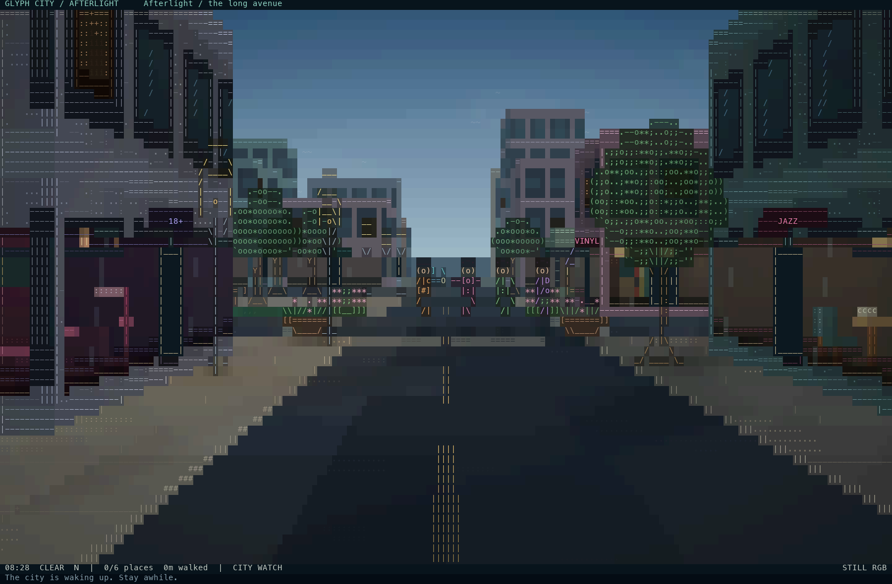
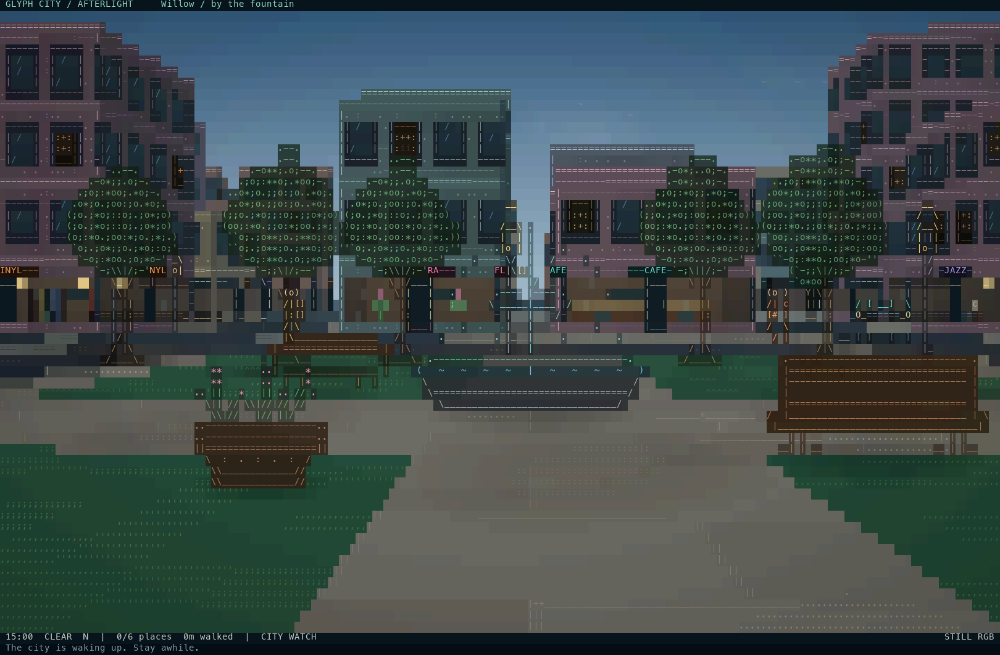

# Preview gallery

These previews are generated from the same renderer used by the terminal game.
Stills use a 180-column, 56-row scene grid in RGB unless marked otherwise.
The City Watch animation uses 144 × 46 scene cells, 10 frames per second, and
20 seconds of real-time movement. It is an edited sequence of three live
camera compositions: dusk aboard the boat, the bridge afterglow, and rain
aboard the night boat. Cuts separate the compositions; movement within each
shot uses the game's City Watch camera and simulation without time acceleration.

These are offline captures of the same RGB renderer used in Ghostty, rather
than screenshots of a terminal window. PNG stills and the lossless animated
WebP retain full RGB. GIF uses one shared 256-color palette to reduce color
flicker between frames. No reflections or lighting were added to the images.

## Cinematic City Watch

[Full-color, lossless animated WebP](media/city-watch.webp)

## Moonwater at dusk

18:00, clear weather, looking from the canal boat. Warm facades, dark building
reflections and cool ripples share the foreground water.

## Moonwater in the rain

21:00, rain, from the same part of the canal. Window light catches the moving
water while the buildings and sky fall into deeper shades.

## Bridge afterglow

17:30, clear weather, elevated above the bridge approach with the canal,
promenade and lit shopfronts in view.

## Morning avenue: terminal color comparison

Both images use the same 08:28 composition. The 256-color image uses the
encoder's actual fixed palette, including its hue-preserving conversion.
The RGB image shows the smoother gradients available with `--truecolor`
on terminals that support 24-bit color.

## Night rain

## Day market

## Willow Gardens

Leafy crowns, flower planters, wooden benches, and the fountain basin use
distinct character shapes. Close objects use additional authored details,
thin structural strokes, and shaded surfaces instead of enlarged glyph blocks.
Press `B` in the game for optional object and material identification.

## Storm canal

## Glass Quarter in mist

## Rooftop corner

